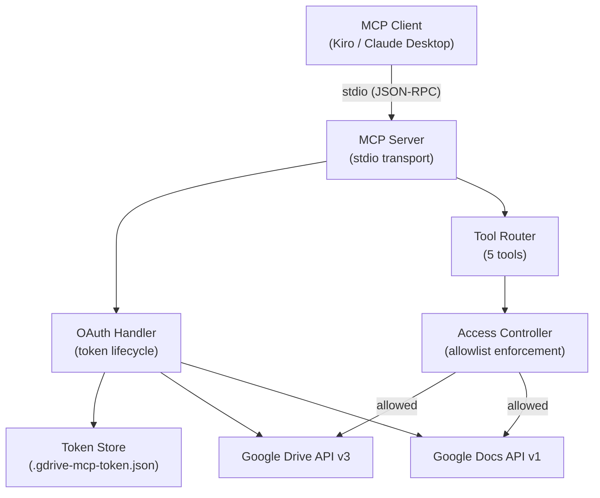

# Design Document: google-drive-mcp

## Overview

google-drive-mcp is a Node.js/TypeScript MCP server that extends the official Anthropic Google Drive MCP server to add Google Docs editing capabilities. It exposes five tools to MCP-compatible clients (Kiro, Claude Desktop): `search_files`, `read_document`, `replace_text`, `add_comment`, and `suggest_edit`.

The server authenticates with Google via OAuth 2.0, enforces access control through environment-variable-configured allowlists, and communicates with clients over stdio transport. It is designed for AI-assisted document workflows — primarily resume editing and document collaboration.

Key design decisions:
- The upstream `@modelcontextprotocol/servers` Google Drive server has been moved to `modelcontextprotocol/servers-archived` and is no longer maintained (last published January 2025). The extracted files from Task 1 are used as a reference only for OAuth patterns and MCP SDK wiring — this is a greenfield build guided by the requirements and design documents.
- The requirements and design documents are the source of truth. Do not inherit patterns or dependencies from the archived code that conflict with or are not called for in the design. If the archived code's OAuth flow or MCP wiring aligns with the design, adopt it — otherwise write fresh implementations.
- The local `google-drive-mcp` folder already exists. When cloning the forked repo, use `git clone <url> .` to clone directly into the current directory and avoid creating a redundant subfolder.
- `suggest_edit` uses comment-based simulation because the Google Docs API v1 cannot programmatically create tracked changes
- `add_comment` and `suggest_edit` share a two-step anchor pattern: fetch doc via Docs API to resolve text offsets, then post via Drive API Comments endpoint
- Access control checks `ALLOWED_DOC_IDS` first, then `ALLOWED_FOLDER_IDS` parent lookup — either passing grants access

---

## Architecture



The server is a single Node.js process. On startup it:
1. Validates required env vars (`GOOGLE_CLIENT_ID`, `GOOGLE_CLIENT_SECRET`)
2. Loads and refreshes the OAuth token (or triggers the auth flow)
3. Parses `ALLOWED_FOLDER_IDS` and `ALLOWED_DOC_IDS` into in-memory sets
4. Registers all five tools with the MCP SDK
5. Starts listening on stdio

All tool invocations pass through the Access Controller before any Google API call is made.

---

## Components and Interfaces

### OAuth Handler

Responsible for the full OAuth 2.0 lifecycle.

```typescript
interface OAuthHandler {
  /** Returns an authenticated google-auth-library OAuth2Client */
  getAuthClient(): Promise<OAuth2Client>;
}
```

- Reads `GOOGLE_CLIENT_ID` and `GOOGLE_CLIENT_SECRET` from `process.env`; exits with a descriptive error if either is missing
- Persists tokens to `~/.gdrive-mcp-token.json` (or `$TOKEN_PATH` if set)
- On load, checks token expiry and calls `refreshAccessToken()` automatically
- If refresh fails, prints the authorization URL and waits for the user to paste the auth code (same flow as the upstream reference implementation)
- Scopes: `https://www.googleapis.com/auth/drive` and `https://www.googleapis.com/auth/documents`

### Access Controller

Enforces the allowlist before any API call.

```typescript
interface AccessController {
  /**
   * Returns true if the given fileId/docId is permitted.
   * Checks ALLOWED_DOC_IDS first, then parent folder via Drive API.
   */
  isAllowed(id: string): Promise<boolean>;

  /**
   * Throws an McpError with ACCESS_DENIED code if not allowed.
   * Convenience wrapper used by all tools.
   */
  assertAllowed(id: string): Promise<void>;

  /**
   * For search_files: validates that a folderId is in ALLOWED_FOLDER_IDS.
   */
  isFolderAllowed(folderId: string): boolean;
}
```

Access check algorithm:
1. If `id` is in `allowedDocIds` set → **grant**
2. Fetch the file's `parents` field from Drive API (`files.get?fields=parents`)
3. If any parent is in `allowedFolderIds` set → **grant**
4. Otherwise → **deny** with `"Access denied: <id> is not in the allowed folders or document list."`

Edge cases:
- Both lists empty → server logs a warning at startup; all access checks pass (no restriction)
- Whitespace in env var values is trimmed during parsing

### Tool Implementations

Each tool is a function with the signature:

```typescript
type ToolHandler = (args: Record<string, unknown>) => Promise<CallToolResult>;
```

#### search_files

```typescript
// Input schema
{ query: string; folderId?: string }
```

- If `folderId` provided: assert it is in `allowedFolderIds`; search within that folder only
- If no `folderId`: build a Drive API query that restricts results to all `allowedFolderIds` using `'<id>' in parents OR ...`
- Returns: `{ id, name, mimeType, modifiedTime }[]`

> **Implementation note — query length limit:** Drive folder IDs are approximately 33 characters each and the Drive API has a query string length limit of around 1,000 characters, meaning queries spanning more than ~20 folders could be rejected. For personal use with a small number of allowed folders this is unlikely to be an issue. Add a code comment flagging this limitation in case `ALLOWED_FOLDER_IDS` grows large in the future.

#### read_document

```typescript
{ documentId: string }
```

- Assert `documentId` is allowed
- Call `docs.documents.get({ documentId })`
- Extract plain text by walking `body.content` structural elements
- Returns: `{ title: string; content: string }`

#### replace_text

```typescript
{ documentId: string; findText: string; replaceText: string }
```

- Assert `documentId` is allowed
- Call `docs.documents.batchUpdate` with `replaceAllText` request
- Returns: `{ replacements: number }`

#### add_comment

```typescript
{ documentId: string; content: string; anchorText: string }
```

Two-step anchor pattern:
1. `docs.documents.get` → walk structural elements to find first occurrence of `anchorText`, record `startIndex` and `endIndex`
2. `drive.comments.create` with `anchor` field set to the JSON-encoded quotedFileContent range

Returns: `{ commentId: string }`

#### suggest_edit

```typescript
{ documentId: string; originalText: string; suggestedText: string }
```

Same two-step anchor pattern as `add_comment`, but comment body is:
`"Suggested edit: replace with '<suggestedText>'"`

Document content is left unmodified.

Returns: `{ commentId: string }`

### MCP Server Wiring

```typescript
const server = new Server(
  { name: "google-drive-mcp", version: "1.0.0" },
  { capabilities: { tools: {} } }
);

server.setRequestHandler(ListToolsRequestSchema, async () => ({ tools: TOOL_DEFINITIONS }));
server.setRequestHandler(CallToolRequestSchema, async (req) => toolRouter(req));

const transport = new StdioServerTransport();
await server.connect(transport);
```

All five tools are registered with full JSON Schema input definitions so clients can discover and validate parameters.

---

## Data Models

### Environment Configuration

```typescript
interface Config {
  googleClientId: string;       // GOOGLE_CLIENT_ID (required)
  googleClientSecret: string;   // GOOGLE_CLIENT_SECRET (required)
  allowedFolderIds: Set<string>; // ALLOWED_FOLDER_IDS (comma-separated, optional)
  allowedDocIds: Set<string>;    // ALLOWED_DOC_IDS (comma-separated, optional)
}
```

Parsing helper:

```typescript
function parseIdList(raw: string | undefined): Set<string> {
  if (!raw) return new Set();
  return new Set(raw.split(",").map(s => s.trim()).filter(Boolean));
}
```

### Token Storage

Stored as JSON at `~/.gdrive-mcp-token.json`:

```typescript
interface StoredToken {
  access_token: string;
  refresh_token: string;
  expiry_date: number; // Unix ms
  token_type: string;
  scope: string;
}
```

### Tool Result Types

```typescript
// search_files
interface FileResult {
  id: string;
  name: string;
  mimeType: string;
  modifiedTime: string;
}

// read_document
interface DocumentContent {
  title: string;
  content: string; // plain text
}

// replace_text
interface ReplaceResult {
  replacements: number;
}

// add_comment / suggest_edit
interface CommentResult {
  commentId: string;
}
```

### Drive API Comment Anchor

The Drive API `comments.create` endpoint accepts an `anchor` field. For text-anchored comments the value is a JSON string:

```typescript
interface CommentAnchor {
  r: "head"; // revision
  a: [{
    line: "real";
    cl: { unit: "characters"; vs: number; ve: number }; // start/end offsets
  }];
}
```

Character offsets are sourced from the Docs API structural element `startIndex` / `endIndex` fields.

> **Caution:** The `CommentAnchor` structure above is based on available documentation, but the Drive API comments anchor format is poorly documented and may behave differently than expected. During implementation, the anchor format should be validated against actual API behavior before being considered final. Treat this interface as a starting point, not a contract.

---

## Correctness Properties

*A property is a characteristic or behavior that should hold true across all valid executions of a system — essentially, a formal statement about what the system should do. Properties serve as the bridge between human-readable specifications and machine-verifiable correctness guarantees.*

### Property 1: ID list parsing strips whitespace and empty entries

*For any* comma-separated string of folder or document IDs (including entries with leading/trailing whitespace, empty segments, or mixed spacing), parsing it into an ID set should produce a set containing exactly the non-empty trimmed IDs and nothing else.

**Validates: Requirements 2.1, 2.2, 2.6**

### Property 2: Access check grants iff doc ID matches or parent folder matches

*For any* file ID, any set of allowed doc IDs, and any set of allowed folder IDs, the access check should return `true` if and only if the file ID is in the allowed doc IDs set OR at least one of the file's parent folder IDs is in the allowed folder IDs set.

**Validates: Requirements 2.3, 2.7, 2.8, 2.9**

### Property 3: Access denied error message format

*For any* file ID that fails the access check, the returned error message should be exactly `"Access denied: <id> is not in the allowed folders or document list."` where `<id>` is the denied file ID.

**Validates: Requirements 2.4**

### Property 4: Token persistence round-trip

*For any* valid OAuth token object, writing it to the token store and then reading it back should produce an equivalent token object with all fields preserved.

**Validates: Requirements 1.4**

### Property 5: Config parsing reads env vars correctly

*For any* environment object containing `GOOGLE_CLIENT_ID` and `GOOGLE_CLIENT_SECRET`, the parsed config should reflect those exact values in the corresponding fields.

**Validates: Requirements 1.2**

### Property 6: Missing required env vars cause startup error

*For any* environment object missing `GOOGLE_CLIENT_ID` or `GOOGLE_CLIENT_SECRET` (or both), startup should throw an error whose message identifies the missing variable(s) by name.

**Validates: Requirements 1.3**

### Property 7: search_files result objects contain required fields

*For any* Drive API file list response, the mapped search results should each contain exactly the fields `id`, `name`, `mimeType`, and `modifiedTime` with values sourced from the corresponding API response fields.

**Validates: Requirements 3.5**

### Property 8: search_files query restricts to allowed folders

*For any* set of allowed folder IDs, the Drive API query string constructed by `search_files` should reference only those folder IDs and no others.

**Validates: Requirements 3.2**

### Property 9: Plain text extraction covers all text runs

*For any* Docs API document response, the extracted plain text should equal the concatenation of all `textRun.content` strings found in the document's structural elements, in document order.

**Validates: Requirements 4.4**

### Property 10: replace_text returns correct replacement count

*For any* Docs API `batchUpdate` response, the replacement count returned to the client should equal the `occurrencesChanged` value from the `replaceAllText` reply.

**Validates: Requirements 5.5**

### Property 11: Comment anchor uses first occurrence offsets

*For any* document and any anchor/original text string that appears one or more times, the `startIndex` and `endIndex` passed to the Drive API Comments endpoint should correspond to the first occurrence of that string in the document's structural elements.

**Validates: Requirements 6.8, 7.8**

### Property 12: suggest_edit comment body format

*For any* `suggestedText` value, the comment body posted by `suggest_edit` should be exactly the string `"Suggested edit: replace with '<suggestedText>'"` where `<suggestedText>` is the literal value of the parameter.

**Validates: Requirements 7.4**

### Property 13: suggest_edit leaves document content unmodified

*For any* valid `suggest_edit` invocation, the document's body content retrieved before and after the call should be identical — no text insertions, deletions, or replacements should occur.

**Validates: Requirements 7.5**

### Property 14: API errors are caught and returned as structured messages

*For any* tool invocation where the underlying Google API call throws an HTTP error or network error, the tool should return a structured error message to the client rather than propagating an unhandled exception.

**Validates: Requirements 9.1, 9.2, 9.3**

---

## Error Handling

### Startup Errors (fatal)

| Condition | Behavior |
|---|---|
| `GOOGLE_CLIENT_ID` missing | Exit with `"Missing required environment variable: GOOGLE_CLIENT_ID"` |
| `GOOGLE_CLIENT_SECRET` missing | Exit with `"Missing required environment variable: GOOGLE_CLIENT_SECRET"` |
| Both missing | Exit listing both variable names |

### Runtime Errors (returned to client, server stays up)

| Condition | Error message |
|---|---|
| Access denied | `"Access denied: <id> is not in the allowed folders or document list."` |
| `anchorText` / `originalText` not found | `"Anchor text not found in document: '<text>'"` |
| Google API HTTP error | `"Google API error (<status>): <message>"` |
| Network timeout | `"Request timed out calling Google API"` |
| Unknown tool | MCP-compliant `MethodNotFound` error response |

### Error Propagation Pattern

All tool handlers wrap their logic in a try/catch. On catch, they return:

```typescript
return {
  content: [{ type: "text", text: `Error: ${err.message}` }],
  isError: true,
};
```

This ensures the MCP server process never crashes due to a tool-level error.

### OAuth Error Handling

- Token refresh failure → log the error, print the authorization URL, and wait for user input (same interactive flow as initial auth)
- Expired token detected before API call → attempt refresh first; only fall back to re-auth if refresh throws

---

## Scalability Considerations

These are not blocking concerns for v1 — this is a personal single-user tool — but are documented here for future reference.

**`read_document` payload size:** The Docs API returns the full document structure as a JSON response including all formatting metadata. For a resume this is negligible, but for large documents the response payload and plain text extraction walk could become slow. Consider adding a size warning or truncation option in a future version.

**Two-step anchor pattern overhead:** Both `add_comment` and `suggest_edit` fetch the full document to resolve character offsets before posting the comment. For a resume this is fine, but if the server is used against larger documents or many sequential comment calls are made, this adds a full document fetch per call. A simple in-memory document content cache with a short TTL would address this when needed.

**Access control parent folder lookup latency:** Every access check that does not match an explicit `ALLOWED_DOC_ID` requires a Drive API call to fetch the file's parent folder. Multiple sequential tool invocations — for example the AI reading a document, adding several comments, and making several replacements — could generate many parent lookup calls. A simple in-memory cache of recently resolved file-to-folder mappings would eliminate redundant lookups and is a recommended v2 improvement.

**OAuth token refresh race condition:** If multiple tool calls fire simultaneously and the OAuth token is expired, concurrent refresh attempts could occur. A simple mutex or refresh lock in the OAuth Handler is recommended before this server is used in any multi-client or high-concurrency context.

---

## Testing Strategy

### Dual Testing Approach

Both unit tests and property-based tests are required. They are complementary:
- Unit tests catch concrete bugs in specific scenarios and integration points
- Property-based tests verify universal correctness across the full input space

### Property-Based Testing

**Library**: [`fast-check`](https://github.com/dubzzz/fast-check) (TypeScript-native, no additional runtime deps)

**Configuration**: Each property test runs a minimum of 100 iterations (`{ numRuns: 100 }`).

Each property test is tagged with a comment referencing the design property:
```
// Feature: google-drive-mcp, Property <N>: <property_text>
```

Each correctness property from the design document maps to exactly one property-based test:

| Design Property | Test description | fast-check arbitraries |
|---|---|---|
| P1: ID list parsing | `fc.string()` inputs with random whitespace/commas | `fc.array(fc.string())` joined with varied separators |
| P2: Access check logic | Random id, docId set, folderId set, parent list | `fc.string()`, `fc.set(fc.string())` |
| P3: Access denied format | Any denied ID | `fc.string()` |
| P4: Token round-trip | Random token objects | `fc.record({...})` |
| P5: Config parsing | Random env objects | `fc.record({...})` |
| P6: Missing env vars | Env objects with one/both keys absent | `fc.option(fc.string())` |
| P7: search_files result fields | Random Drive API file objects | `fc.record({...})` |
| P8: search_files query construction | Random allowed folder ID sets | `fc.set(fc.string())` |
| P9: Plain text extraction | Random Docs API document structures | custom `fc.letrec` document generator |
| P10: Replacement count | Random batchUpdate responses | `fc.integer({ min: 0 })` |
| P11: First occurrence anchor | Random document + anchor string | custom document + substring generator |
| P12: suggest_edit comment body | Any `suggestedText` string | `fc.string()` |
| P13: Document unmodified after suggest_edit | Any valid suggest_edit call (mocked APIs) | `fc.record({...})` |
| P14: API errors caught | Any tool + any thrown error | `fc.oneof(...)` error generators |

### Unit Tests

Unit tests focus on specific examples, edge cases, and integration points that property tests don't cover well:

- Startup exits with correct message for each missing env var combination
- `search_files` with no `folderId` builds query spanning all allowed folders
- `search_files` with non-allowed `folderId` returns access denied
- `read_document` returns title and content for a known fixture document
- `replace_text` returns zero replacements when `findText` absent
- `add_comment` returns error when `anchorText` not found
- `suggest_edit` returns error when `originalText` not found
- `suggest_edit` does not call `batchUpdate` (document stays unmodified)
- All five tools registered in `ListTools` response
- Each tool definition has a valid JSON Schema `inputSchema`
- Unknown tool name returns MCP `MethodNotFound` error
- OAuth token refresh is called when `expiry_date` is in the past
- Auth URL is surfaced when token refresh fails
- Empty `ALLOWED_FOLDER_IDS` + `ALLOWED_DOC_IDS` logs startup warning

### Test File Structure

```
src/
  __tests__/
    config.test.ts        # P1, P5, P6 + unit tests for env parsing
    access-control.test.ts # P2, P3 + unit tests for access check order
    oauth.test.ts          # P4 + unit tests for refresh/re-auth flows
    tools/
      search-files.test.ts  # P7, P8 + unit tests
      read-document.test.ts # P9 + unit tests
      replace-text.test.ts  # P10 + unit tests
      add-comment.test.ts   # P11 + unit tests
      suggest-edit.test.ts  # P12, P13 + unit tests
    error-handling.test.ts  # P14 + unit tests for error propagation
    mcp-registration.test.ts # tool registration + schema validation
```

**Test runner**: `vitest` (compatible with the TypeScript project setup, supports `--run` for single-pass CI execution)

### Test Execution Order

In CI, `mcp-registration.test.ts` should be configured to run before all other test files. Tool registration and JSON Schema wiring failures will cause all tool-level tests to fail in misleading ways — catching registration issues first produces clearer failure output and faster debugging.
